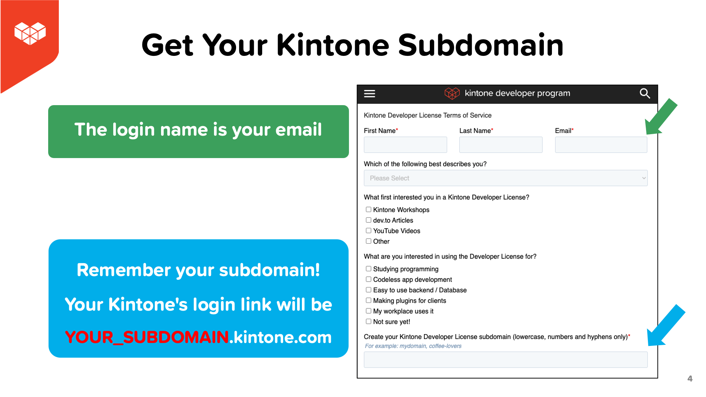
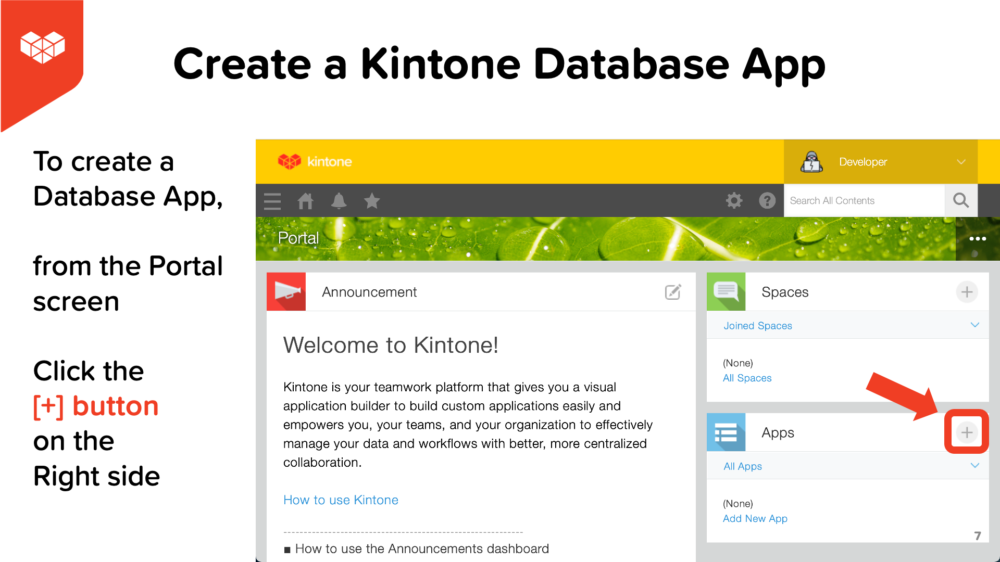

# Quick Start on Using Kintone Web Database in a Hackathon Project

## Outline <!-- omit in toc -->
* [3 Reasons to Use Kintone for your hack](#3-reasons-to-use-kintone-for-your-hack)
* [🚀 Getting your FREE Kintone Database](#-getting-your-free-kintone-database)
  * [1. Fill out the Kintone Developer License Registration form](#1-fill-out-the-kintone-developer-license-registration-form)
  * [2. Check your email & click `Activate Now`](#2-check-your-email--click-activate-now)
* [💪 Using your Kintone Database](#-using-your-kintone-database)
  * [3. Let's Log into Kintone](#3-lets-log-into-kintone)
  * [4. Create a Kintone Database App](#4-create-a-kintone-database-app)
* [📺 How to Create a Kintone Database App? - Video](#-how-to-create-a-kintone-database-app---video)
* [How to generate a Kintone API Token?](#how-to-generate-a-kintone-api-token)
* [Where Can I Get Help?](#where-can-i-get-help)
* [What can I build with Kintone?](#what-can-i-build-with-kintone)
  * [Running an easily configurable Space Invaders game on Kintone](#running-an-easily-configurable-space-invaders-game-on-kintone)
  * [Connect IoT Obniz Board to Kintone Web Database all in 10 minutes](#connect-iot-obniz-board-to-kintone-web-database-all-in-10-minutes)
  * [Deploy a REST API calling node.js App to Heroku](#deploy-a-rest-api-calling-nodejs-app-to-heroku)
  * [React, REST API, & Kintone: GET & POST to a Web Database](#react-rest-api--kintone-get--post-to-a-web-database)
* [More Resources](#more-resources)

## 3 Reasons to Use Kintone for your hack
1. No servers are needed! - Ridiculously fast to build databases!
1. Effortlessly manage database data and schema with GUI!
1. Super simple to build JS customizations!

## 🚀 Getting your FREE Kintone Database

### 1. Fill out the Kintone Developer License Registration form
Head over to the [Developer License Registration Form](https://kintone.dev/en/developer-license-registration-form/#terms-of-service-for-the-developer-license)
* ✅ Accept the Cookies first
* ✅ Use Chrome & Firefox

When creating your Kintone Subdomain:
* ⚡ Only use lowercase, numbers, & hyphens in your subdomain
* ⚠ Do not use uppercase or special characters

### 2. Check your email & click `Activate Now`

After submitting the form, you will get a confirmation email with an `Activate Now` button.
* Email title: `Welcome to Kintone! One More Step to Developer License`

Then you will be redirected to your Kintone Subdomain to set the initial password.

|                                                                                    |                                                                                                              |
| ---------------------------------------------------------------------------------- | ------------------------------------------------------------------------------------------------------------ |
|  |  |

## 💪 Using your Kintone Database
### 3. Let's Log into Kintone

Once you create your Kintone Subdomain, it is super simple to access it.

Simply go to `YOUR_SUBDOMAIN.kintone.com` with `YOUR_SUBDOMAIN` swapped with your unique Kintone Subdomain.

### 4. Create a Kintone Database App

To create a Database App, from the Portal screen, click the [+] button on the right side next to the **Apps** section.

|                                                   |                                                          |
| ------------------------------------------------- | -------------------------------------------------------- |
|  |  |

---

## 📺 How to Create a Kintone Database App? - Video

Check out this guide that goes over creating an example Manga Database App.

  

## How to generate a Kintone API Token?

To generate an API Token for a Kintone App:
  1. Go to the Kintone App
  1. Go to the Gear icon ⚙️ (top right corner) > Open the App Settings page
  1. Click on the **App Settings** Tab > Click on **API Token** settings
  1. Click the `Generate` button to generate a token
  1. Click the `Save` button (top left corner) to save the token setting
  1. Finally, click the `Update App` button (top right corner) to implement the token setting change.

Confused? 🤔 → Check out the [Get the API Token](https://youtu.be/pRtfn-8cf_I?t=117) video clip 📺  

---

## Where Can I Get Help?
If you are stuck, post your question & code on the [Kintone Developer forum](https://forum.kintone.dev/)!

If a Kintone mentor is available, post on Discord!

We are more than happy to answer any questions or help fix any problems regarding Kintone.

---

## What can I build with Kintone?
Here are a few projects that use Kintone as the web database!  

### Running an easily configurable Space Invaders game on Kintone

  

This is a phaser.io game running on Kintone. It is super easy to get started! No need to set up a node.js environment or AWS serverless environment! You just need a code editor & Kintone account.

Check out the tutorial on [Having Fun with Browser Games & Web databases - DEV Community 👩‍💻👨‍💻](https://dev.to/will_yama/having-fun-with-phaser-io-games-web-databases-4f08)

### Connect IoT Obniz Board to Kintone Web Database all in 10 minutes

  

[Obniz Board](https://obniz.com/products/Obnizboard/) is an IoT Microprocessor that is easily programable with JavaScript! Since Kintone supports [JavaScript customizations](https://get.kintone.help/k/en/user/app_settings/js_customize.html), it is the best web database to integrate with Obniz Board!

Here is a step-by-step tutorial explaining everything you need to get an Obniz Board exporting data to the Kintone web database!

[Setup Obniz Board as a counter & store data in Kintone Web Database all in 10 minutes! - DEV Community 👩‍💻👨‍💻](https://dev.to/ahandsel/setup-obniz-board-as-a-counter-store-data-in-kintone-web-database-all-in-10-minutes-23e)

### Deploy a REST API calling node.js App to Heroku

  

In this particular example, the node.js app retrieves record data from a Kintone web database via REST API and displays it on the page of the node.js app.

Check out the tutorial on [Deploy a REST API calling node.js App to Heroku - DEV Community 👩‍💻👨‍💻](https://dev.to/will_yama/deploy-a-rest-api-calling-node-js-app-to-heroku-2mia)

### React, REST API, & Kintone: GET & POST to a Web Database

  

This is a recording from Kintone's React workshop series! We go over how to set up a React project and Express server to access data stored in Kintone!

Code & Slides are available at this GitHub Repo:

[ahandsel/React_Workshop_by_Kintone](https://github.com/ahandsel/React_Workshop_by_Kintone)

Clone the codebase & follow along with the video to build out the POST functionality!
If you are stuck, check out the [GET_n_POST branch](https://github.com/ahandsel/React_Workshop_by_Kintone/tree/GET_n_POST) with the completed version!

---

## More Resources

| Resource                | Link                                                                                           |
| ----------------------- | ---------------------------------------------------------------------------------------------- |
| Get Started Guide       | [kintone.dev/en/quickstart](https://kintone.dev/en/quickstart/)                                |
| YouTube Channel         | [youtube.com/c/KintoneDeveloperProgram](https://www.youtube.com/c/KintoneDeveloperProgram)     |
| Kintone Dev Forum       | [forum.kintone.dev](https://forum.kintone.dev/)                                                |
| Intro to Kintone Slides | [ahandsel.github.io/kintone-for-hackathon/](https://ahandsel.github.io/kintone-for-hackathon/) |
| Kintone API Docs        | [kintone.dev/en/docs/](https://kintone.dev/en/docs/)                                           |
| Kintone Tutorials       | [kintone.dev/en/tutorials/](https://kintone.dev/en/tutorials/)                                 |
