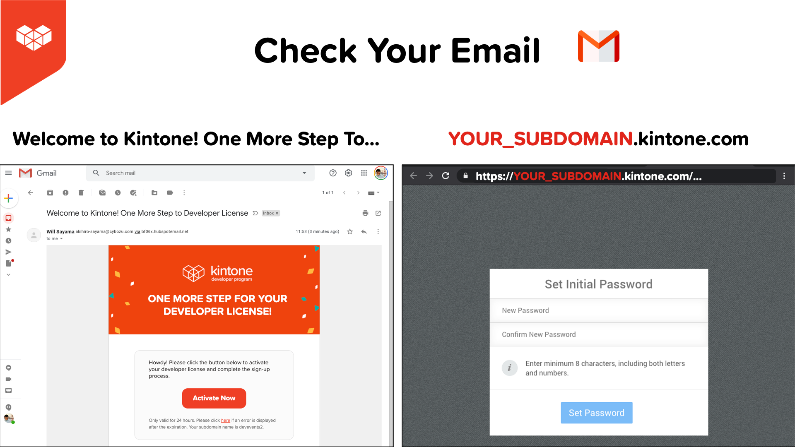

# Quick Start on Using Kintone Web Database in a Hackathon Project

## Outline <!-- omit in toc -->
* [3 Reasons to Use Kintone for your hack!](#3-reasons-to-use-kintone-for-your-hack)
* [🚀 Getting your FREE Kintone Database](#-getting-your-free-kintone-database)
  * [1. Fill out the Kintone Developer License Registration form](#1-fill-out-the-kintone-developer-license-registration-form)
  * [2. Check your email & click `Activate Now`](#2-check-your-email--click-activate-now)
* [💪 Using your Kintone Database](#-using-your-kintone-database)
  * [3. Let's Log into Kintone](#3-lets-log-into-kintone)
  * [4. Create a Kintone Database App](#4-create-a-kintone-database-app)
* [📺 How to Create a Kintone Database App? - Video](#-how-to-create-a-kintone-database-app---video)
* [How to generate a Kintone API Token?](#how-to-generate-a-kintone-api-token)
* [Where Can I Get Help?](#where-can-i-get-help)
* [What can I build with Kintone?](#what-can-i-build-with-kintone)
* [More Resources](#more-resources)

## 3 Reasons to Use Kintone for your hack!
1. No servers are needed! - Ridiculously fast to build databases!
1. Effortlessly manage database data and schema with GUI!
1. Super simple to build JS customizations!

## 🚀 Getting your FREE Kintone Database

### 1. Fill out the Kintone Developer License Registration form
Head over to the [Developer License Registration Form](https://kintone.dev/en/developer-license-registration-form/#terms-of-service-for-the-developer-license)
* ✅ Accept the Cookies first
* ✅ Use Chrome & Firefox

When creating your Kintone Subdomain:
* ⚡ Only use lowercase, numbers, & hyphens in your subdomain
* ⚠ Do not use uppercase or special characters

### 2. Check your email & click `Activate Now`

After submitting the form, you will get a confirmation email with an `Activate Now` button.
* Email title: `Welcome to Kintone! One More Step to Developer License`

Then you will be redirected to your Kintone Subdomain to set the initial password.

|                                                                                    |                                                                                                              |
| ---------------------------------------------------------------------------------- | ------------------------------------------------------------------------------------------------------------ |
|  |  |

## 💪 Using your Kintone Database
### 3. Let's Log into Kintone

Once you create your Kintone Subdomain, it is super simple to access it.

Simple go to `YOUR_SUBDOMAIN.kintone.com` with `YOUR_SUBDOMAIN` swapped with your unique Kintone Subdomain.

### 4. Create a Kintone Database App

To create a Database App, from the Portal screen, click the [+] button on the right side next to the **Apps** section.

|                                                   |                                                          |
| ------------------------------------------------- | -------------------------------------------------------- |
|  |  |

---

## 📺 How to Create a Kintone Database App? - Video

Check out this guide that goes over creating an example Manga Database App.

  

## How to generate a Kintone API Token?

To generate an API Token for a Kintone App:
  1. Go to the Kintone App
  2. Go to the Gear icon ⚙️ (top right corner) > Open the App Settings page
  3. Click on the **App Settings** Tab > Click on **API Token** settings
  4. Click the `Generate` button to generate a token
  5. Click the `Save` button (top left corner) to save the token setting
  6. Finally, click the `Update App` button (top right corner) to implement the token setting change.

Confused? 🤔 → Check out the [Get the API Token](https://youtu.be/pRtfn-8cf_I?t=117) video clip 📺  

---

## Where Can I Get Help?
If you are stuck, post your question & code on the [Kintone Developer forum](https://forum.kintone.dev/)!

If a Kintone mentor is available, post on the Slack workspace!

We are more than happy to answer any questions or help fix any problems regarding Kintone

---

## What can I build with Kintone?

Check out [Kintone_Builds.md](Kintone_Builds.md)

---

## More Resources

|                   |                                                                                            |
| ----------------- | ------------------------------------------------------------------------------------------ |
| Get Started Guide | [kintone.dev/en/quickstart](https://kintone.dev/en/quickstart/)                            |
| YouTube Channel   | [youtube.com/c/KintoneDeveloperProgram](https://www.youtube.com/c/KintoneDeveloperProgram) |
| Kintone Dev Forum | [forum.kintone.dev](https://forum.kintone.dev/)                                            |
