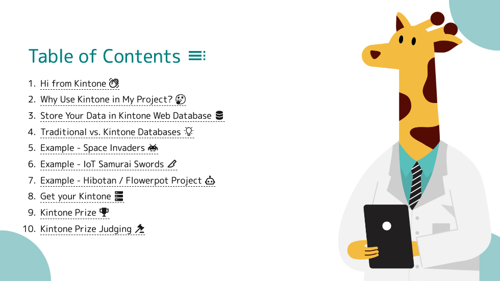
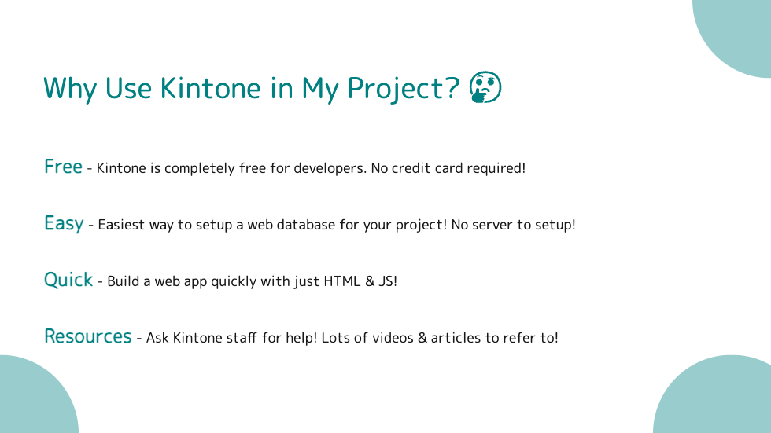
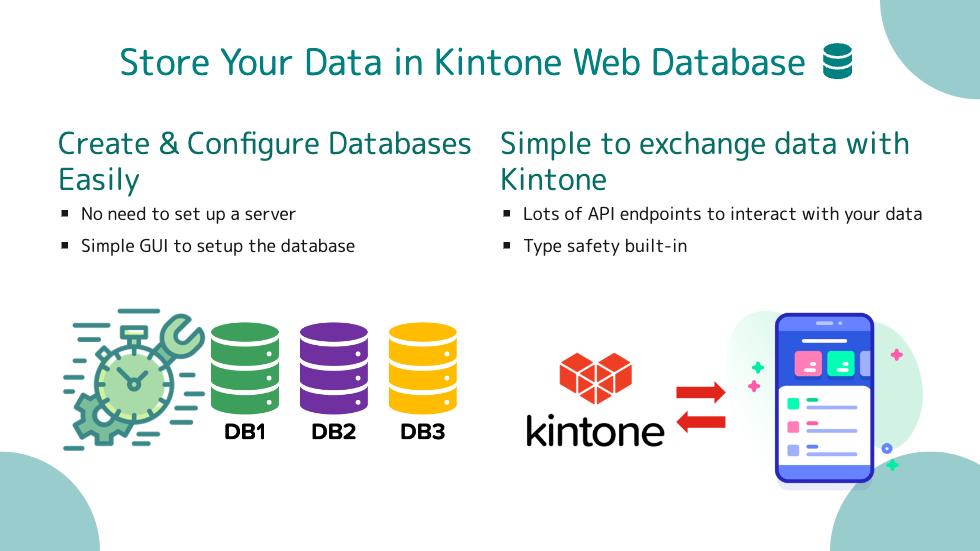
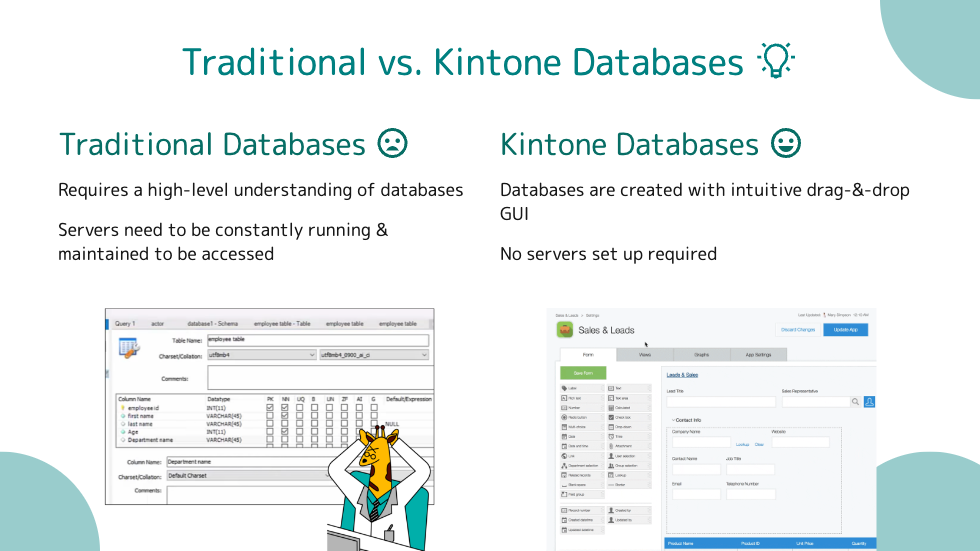
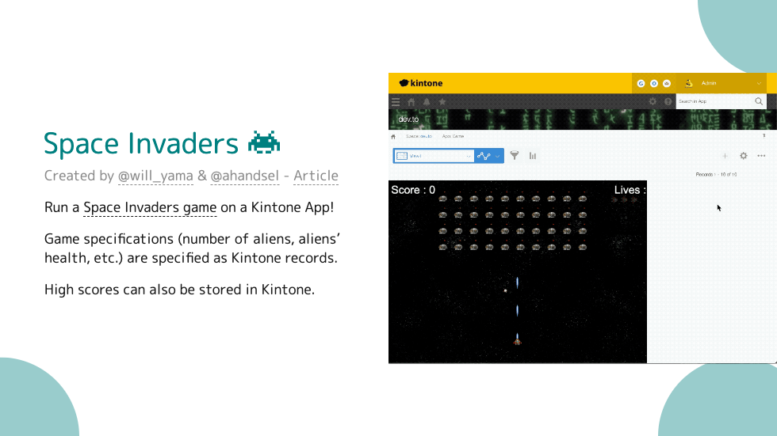
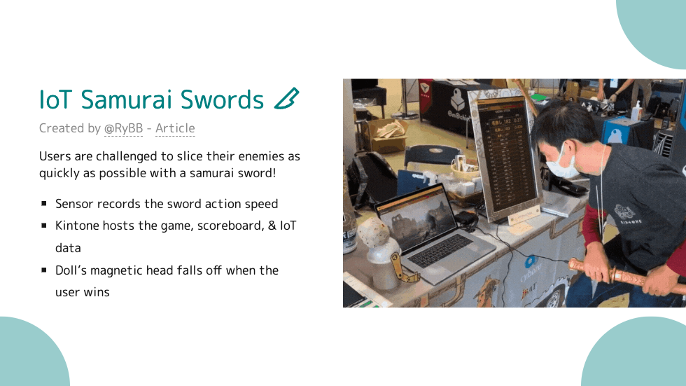
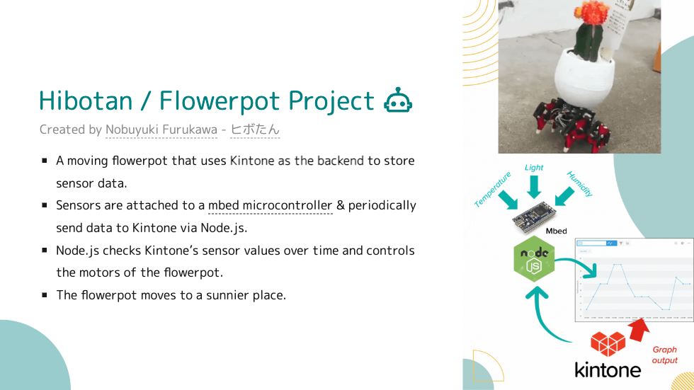
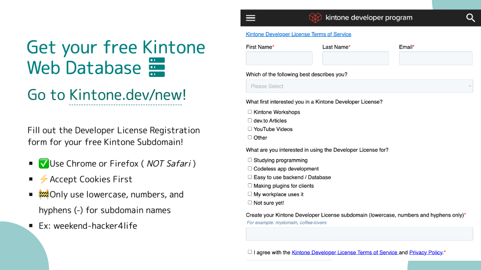
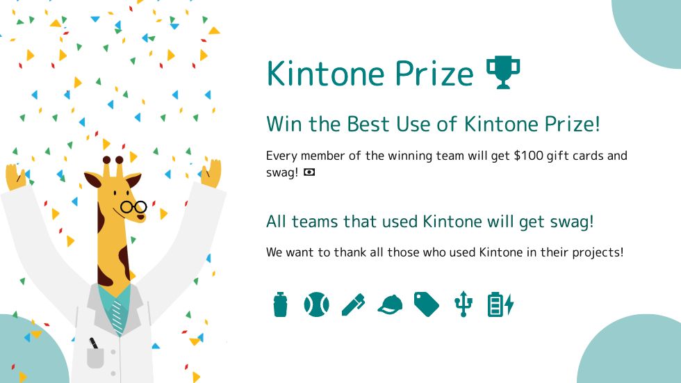

Hi everyone! Let's go over why you WANT to use Kintone as a web database for YOUR hackathon project!

### Erica Butts
* Sales Engineer at Kintone
* Graduate student of Software Engineering at NJIT
* Based in Brooklyn, NY
* Passionate about space and technology.

### Genji Fujimori
* Developer Advocate at Kintone
* Graduated from UC Santa Cruz
* Based in Tokyo, JP
* Passionate about hiking & economics!

### Slide 2

### Slide 4

* Goal: Make attendees feel like super fast anime samurais
* Sword: magnet sensors to detect in & out motion speed
* doll with electric magnet to have its head fall off
* 2 M5Stick microcontrollers were used for sword & doll
* The score ranking displayed information stored in the Kintone App, where scores of participants were automatically recorded via REST API after they finished playing the game.

Last slide

